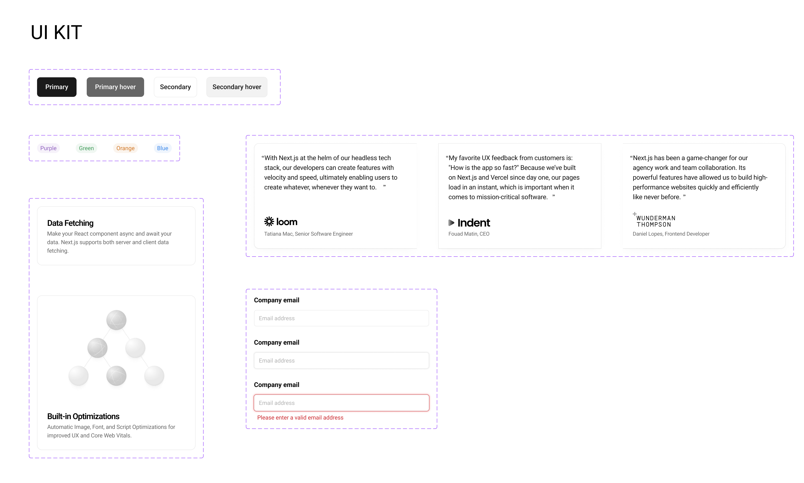

# Storybook and Chromatic Integration Repository

Welcome to the [Storybook](https://storybook.js.org/) and [Chromatic](https://www.chromatic.com/storybook) integration repository! This repository serves as a comprehensive guide and demonstration of utilizing Storybook along with Chromatic for effective component development and testing.

## Overview

In this repository, you will find a collection of examples and implementations showcasing how to leverage Storybook for component-driven development. The repository includes various implemented components designed to match a [Figma design](https://www.figma.com/file/GIyivL3AeBjiTc8zTtXzx5/Frontend-EOI?type=design&node-id=39-35&mode=design&t=dFtg7e610Ddo7fWi-4), providing an excellent opportunity for practicing and implementing real-world designs.

To view the Figma design referenced in this repository, please visit Figma Design. Below is a snapshot of the design for reference:

## Features

### Storybook Integration

Storybook is a powerful tool for developing UI components in isolation, enabling developers to build, document, and test components independently. In this repository, you'll find numerous examples demonstrating how to use Storybook effectively.

### Chromatic Integration

Chromatic is the Storybook cloud service that seamlessly integrates with your Storybook setup. It allows you to run visual tests automatically whenever changes are made to your components. By integrating Chromatic into your workflow, you can ensure that your UI components remain consistent and visually appealing across different environments.

### Examples

- Accessibility Plugin: Explore examples demonstrating how to enhance accessibility within your components, ensuring inclusivity for all users.

- Visual Tests: Learn how to conduct visual tests using Chromatic to detect any visual discrepancies or regressions in your UI components.

- Interaction Tests: Discover examples showcasing how to test component interactions to ensure smooth user experiences.

## Getting Started

To get started with this repository, follow these steps:

1. Create a new repository from [the template](https://github.com/new?template_name=storybook-testing&template_owner=DanielRamosAcosta).
2. Clone the repository to your local machine.
3. Install dependencies by running npm install.
4. Explore the various examples and implementations within the repository.
5. Refer to the documentation and comments within the code for detailed explanations and instructions.
6. Integrate Storybook and Chromatic into your own projects following the patterns and practices demonstrated here.

## Contributions

Contributions to this repository are welcome! If you have any suggestions, improvements, or additional examples to add, feel free to open an issue or submit a pull request. Let's collaborate to make component development and testing more accessible and efficient for everyone.

## License

This repository is licensed under the MIT License, allowing you to use, modify, and distribute the code freely. However, attribution is appreciated.

---

Thank you for exploring our Storybook and Chromatic integration repository! We hope you find it helpful and informative. Happy coding! 🚀
